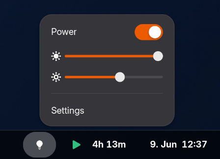
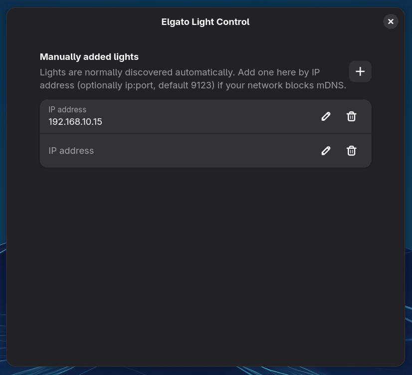

# Elgato Light Control

[](https://extensions.gnome.org/extension/10118/elgato-light-control/)

[](LICENSE)

[](https://www.paypal.com/donate?hosted_button_id=WX4VWRKS89666)

A GNOME Shell extension to control your [Elgato Key Lights](https://www.elgato.com/) from the top panel: power, brightness and colour temperature.

Lights are discovered automatically on your local network over mDNS (via the Avahi daemon that ships with most Linux distributions). Plug a light in and it appears in the menu; change its IP and the extension follows.

## Screenshots

| Panel menu | Preferences |
| --- | --- |
|  |  |

## Features

- Automatic discovery of Key Lights over the network (IPv4 and IPv6).
- Turn lights on and off.
- Adjust brightness and colour temperature.
- Controls every light found; multiple lights get their own submenu.
- Optional manual entry by IP address for networks that block mDNS.

## Requirements

- GNOME Shell 45–50.
- A running `avahi-daemon` (standard on most distributions; `systemctl status avahi-daemon`).

## Installation

### From extensions.gnome.org (recommended)

Install it in one click from the extension page:

**[extensions.gnome.org/extension/10118/elgato-light-control](https://extensions.gnome.org/extension/10118/elgato-light-control/)**

This needs the [browser integration](https://wiki.gnome.org/Projects/GnomeShellIntegration) (the browser add-on plus `gnome-browser-connector`). Alternatively, install the [Extension Manager](https://flathub.org/apps/com.mattjakeman.ExtensionManager) app and search for "Elgato Light Control".

### From source

```sh
git clone https://github.com/Cluster2a/gnome-shell-extension-elgato-light-control.git
cd gnome-shell-extension-elgato-light-control
gnome-extensions pack elgato-light-control@cluster2a.github.io \
    --extra-source=lightBrowser.js --extra-source=keyLight.js --extra-source=icons --force
gnome-extensions install --force elgato-light-control@cluster2a.github.io.shell-extension.zip
```

Then load the extension:

- **Wayland:** log out and back in (the shell can't hot-reload extensions).
- **X11:** press `Alt`+`F2`, type `r`, press `Enter`.

Finally enable it:

```sh
gnome-extensions enable elgato-light-control@cluster2a.github.io
```

## Usage

Click the light icon in the panel. Discovered lights appear automatically; open the menu to toggle power and drag the brightness and temperature sliders. The current state is read from each light every time the menu is opened.

If a light cannot be discovered (for example on a network that blocks mDNS), open **Settings** and add it by IP address (`ip` or `ip:port`, default port `9123`).

## Compatibility

| GNOME Shell | Status |
| --- | --- |
| 50 | ✅ Tested |
| 45 – 49 | Expected to work (same ESM API; not actively tested) |
| ≤ 44 | ❌ Unsupported (pre-ESM extension API) |

## Contributing

Issues and pull requests are welcome. Please keep the GTK/Adwaita code in `prefs.js` and the
shell-side code in `extension.js` separate, and make sure the extension cleans up fully in
`disable()`.

## Credits

Network discovery is based on the Avahi/D-Bus approach contributed by Owen Taylor in [issue #2](https://github.com/Cluster2a/gnome-shell-extension-elgato-light-control/issues/2), used here under the MIT license.

## License

GPL-2.0-or-later. See [LICENSE](LICENSE).
